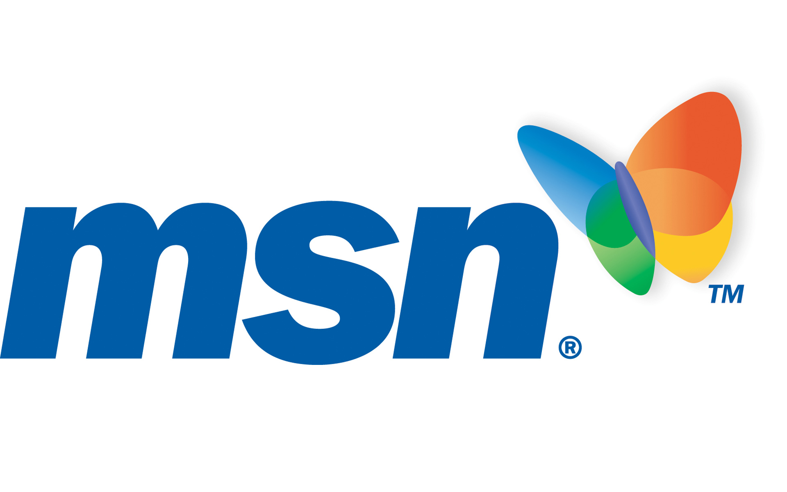
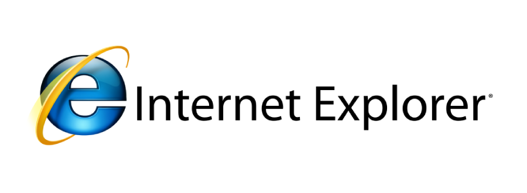

<meta name="description" content="The quick brown fox jumped over the lazy dog.">
<meta name="author" content="John Smith">

#                        Browser War

[_metadata_:authors]:- "Leron Charles, Oluwatoyin Alabede"
[_metadata_:tags]:- "internet, browswer, browser-war, internet-pioneer"  
---
####  General Info
-  Leron Charles , Oluwatoyin Alabede
-   **How Microsoft Shutdown Netscape**
---
### Website General Info
-   **Description**: Microsoft, in a fierce competion with Netscape
-   **Keywords**: war ,browser war, bill gates, microsoft, netscape, mark andreesen
-   **Website Title**: Browser War
-   **Page Title**: History of Microsoft and Netscape
-   **Hero Text**: The Most Interesting Battle of The Broswer Wars.
---
### Website Main Menu 
-    Internet Explorer vs Netscape Navigator
### Home
-   **Menu Link**: Home Story About
-   **Page Title**: History of the War
-   **Description**: The First Browser ever created after the invention of the World Wide Web
-   **Keywords**: mark andreesen, mosaic, tim burners lee, netscape, jim clark
-   **Page Layout**:   Z layout
-   **Page Content**: After the creation of the World Wide Web invented by [Tim Burners Lee](https://www.w3.org/People/Berners-Lee/) in 1992, a graduate student from the University of Illinois whose name is [Marc Andreessen](https://en.wikipedia.org/wiki/Marc_Andreessen) created the first Web Browser to take the internet to the next level, [*Mosaic*](http://www.ncsa.illinois.edu/enabling/mosaic). In 1993, Mosaic was not the first browser that internet had seen, but it was a revolutionary one. It gave the internet the capability of multimedia which something that a lot of people did not think was possible. With Mosaic, users were able to browse for image, audio, and videos. It was the essence of user friendly, it made the internet a place of entertainment, and a place to be.

     After Mosaic, Marc Andreessen went to James, H. clark for financial support, and together they created a company called [Netscape](https://en.wikipedia.org/wiki/Netscape).The company was very successful when it first launched. JavaScript, one of the widely used programming languages, full of libraries today was created by a developer from Netsape. Although the company was widely recognized for its amazing and life changing broswer, there was one guy, who was watching very closely. A guy who loves competion and would do anything to always be on the wining side; his name is [Bill Gates](https://en.m.wikipedia.org/wiki/Bill_Gates).
---
###  Sidebar Content 
-   **The Launch of MSN by Microsoft, in response to Netscape.**

     In 1994, Gill Gates, the CEO of Microsoft wanted to be on the wining side, so he decided to launch MSN which stands for Microsoft Network. In the same idea of Mosaic, MSN gave users the capability to browse the web in a more vibrant way. It enabled the capabilities of graphics such as images, and videos. It also allowed users to browse for information. From that time on, everyone knew it would be the [First Browser War]().

---
### Sidebar Image
-   **Image Link**: 
-   **Image Alt Attribute**: Microsoft Network 
-   **Sidebar Text**: The network Microsoft was created in reponse to Netscape.
---
### Page Image
-   **Page Image Link**: 
-   **Page Image Alt attribute**: Mosaic

### Footer Menu

---
### Story Page
-   **Menu Link**: Home, About
-   **Page Title**: The Main Cause of of the War
-   **Description**: Microsoft's failed attempt to buy Netscape led to the creation of Internet Explorer
-   **Keywords**: Internet explorer, bill gates
-   **Page Layout**: Z layout
-   **Page Content**: After the creation of MSN in 1994, Microsoft had success. However, they did not know that Netscape had something in store. In the same year, Netscape launched another web broswser that would take te internet for good; and its name was [Netscape Navigator](https://en.wikipedia.org/wiki/Netscape_Navigator).
---
### Footer Menu
---
###  Sidebar Content 
-   The browser war was escalated when Mark Andreesen called Microsoft engineers, "a set of poorly debugged devise drivers" in an article. The statement shifted everyone's focus at Microsoft to "crush Netscape by any means necessary", creating internet explorer with much better versions in comparison to Netscape Navigator [Internet Explorer](https://en.wikipedia.org/wiki/Internet_Explorer) and made it free for users. Microsoft also instructed the PC manufacturers to not install Netscape browser or else, they would lose their Windows license, thereby monopolizing the internet.
---
### Sidebar Image
-   **Image Link**: 
-   **Image Alt Attribute**: Internet Explorer
-   **Sidebar Text**: Microsoft's efforts to crush Netscape Navigator.
---
### Page Image
-   **Page Image Link**:
-   **Page Image Alt attribute**: Chess
--- 
### Footer Menu
   Home Story About
### About Page
-   **Menu Link**: Home, About
-   **Page Title**: Anti-trust lawsuit
-   **Description**: Anti-trust lawsuit against Microsoft for using Windows to dominate the internet
-   **Keywords**: Anti-trust lawsuit, Gary Reback, Microsoft
-   **Page Layout**: Z layout
-   **Page Content**: A lawsuit was filed against Microsoft in federal court by Gary Reback, an anti-trust lawyer. Bill Gates was accused of using MS Windows to prevent consumers from accessing Netscape's products. Microsoft was found guilty and the judge in charge of the case recommended that the company be split up. A federal appeals court felt the verdict was too harsh and rescinded the order. After the trial, Bill Gates decided to retire and pass the CEO position to his long time friend [Steve Balmer](https://en.wikipedia.org/wiki/Steve_Ballmer). 
---
###  Sidebar Content
-   Microsoft's stock was high because of internet explorer but after the initial verdict on the lawsuit, the stocks dropped by $30b overnight.
---
### Footer Menu 
---

